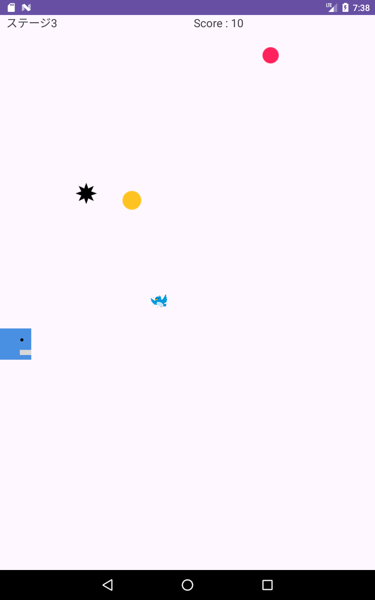
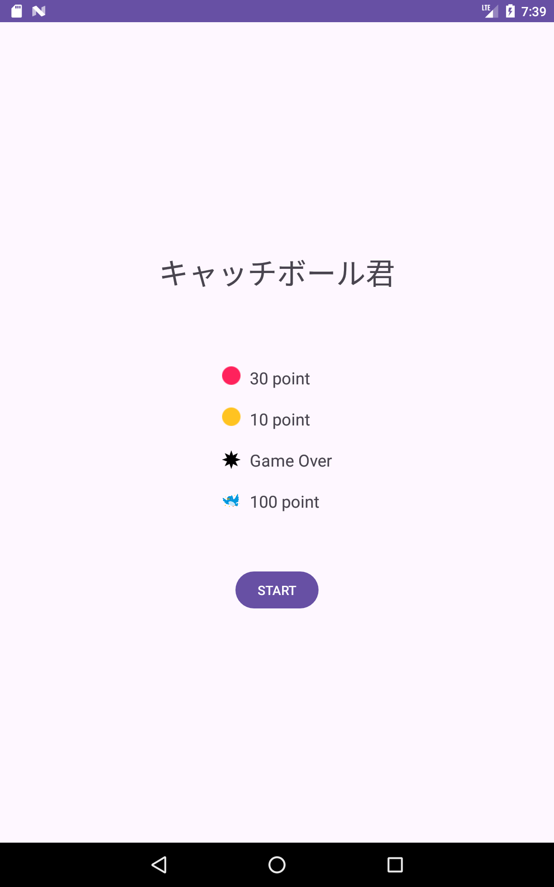

# キャッチボール君

## 概要
このプロジェクトは、Android Studioを使用して開発されたシンプルな2Dゲームです。プレイヤーは障害物を避けながらポイントを集めていくことが目的です。

## スクリーンショット

## インストール方法
1. [リリースページ](https://github.com/username/my-android-game/releases)から最新のAPKをダウンロードします。
2. APKファイルをAndroidデバイスにインストールします。
3. ゲームを起動してプレイを開始します。

## 使用技術
- **言語**: Java
- **IDE**: Android Studio

## 機能
- 障害物を避けながらポイントを集めるシンプルなゲームプレイ
- ステージの遷移機能
- 音楽と効果音

## 開発プロセス

1.ハンズオン形式でゲーム全体を制作
（https://codeforfun.jp/android-studio-catch-the-ball-intro/）
2. ハンズオン以上のものを作りたいと思い追加機能として、BGMを追加

## 自分で追加した機能
1. スタート画面、ステージセレクト画面、クリア画面を追加
2. 青い鳥のオブジェクトを追加して複雑な動きを追加
3. クリアした後や、ゲームオーバーになった後にステージセレクトや
スタート画面に戻るようにした

## 課題点
1. ゲームオーバーになった際に、もう一度プレイするのボタンを押すと
必ずstage1に遷移する。finish();で前の画面に戻りゲームをもう一度
したいと考えましたが、ゲームオーバーになるブロックにあたった状態に
なる。

2. ステージ変更機能を追加したが実際に難易度が変わっているわけではないこと

3. オブジェクト指向の考えを学んでいるがそれを実際のコードに落とし込むのが難しいため、
コードのベタ打ちになっている。

4. コードを見て理解することは出来るが、0ベースから何かを作るのに課題を感じる
今後は、ハンズオンをいくつかこなした後に0から自分で作る経験を増やしていきたい